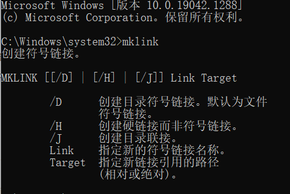

以管理员方式运行CMD



命令说明：

/H 为文件创建目录链接（硬链接）

/J 为文件夹创建目录链接（硬链接）

/D 为文件夹创建符号链接

创建硬链接后，使用剪切操作，只会将链接当中的文件剪切走，但文件夹入口仍然保留在原地

创建符号链接后，使用剪切操作，只会同时将文件夹入口剪切到其他地方去

故：符号链接更加灵活，硬链接会保持入口固定

```
mklink /D "B:\share" "B:\OneDrive\共享"
```

<br/>

基于以上知识，我们给C盘软件搬家：

1.将edge的安装路径下所有文件复制到其他盘,确保无误删除C盘对应的数据文件夹

```
#windows无法使用cp命令，这里仅仅是举例
mv C:\Program Files (x86)\Microsoft\Edge D:\Edge
```

2.在C盘原始位置设置文件夹入口点

```
mklik /D "C:\Program Files (x86)\Microsoft\Edge" "D:\Edge"
```

此时，搬家完成，程序访问C盘当中的入口点时会跳到D盘，前端透明，程序感知不到，所以不会出现问题。

<br/>

如果我们想要恢复原来的样子，只需要删除C盘的文件夹入口点（删除入口点，不会删除掉源文件的），然后再将D盘的文件夹移动回来即可而
